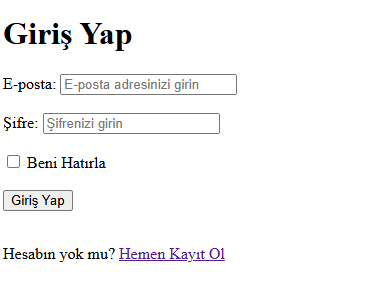
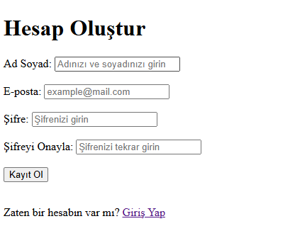

# HTML Login & Signup Practice

Bu projede, temel HTML bilgilerini kullanarak bir **Giriş (Login)** ve **Kayıt (Signup)** formu tasarlandı.

## Sayfalar

- `login.html`: Kullanıcı giriş formu
- `signup.html`: Yeni kullanıcı kayıt formu

### 🔐 Giriş Yap Sayfası

### 📝 Kayıt Ol Sayfası

